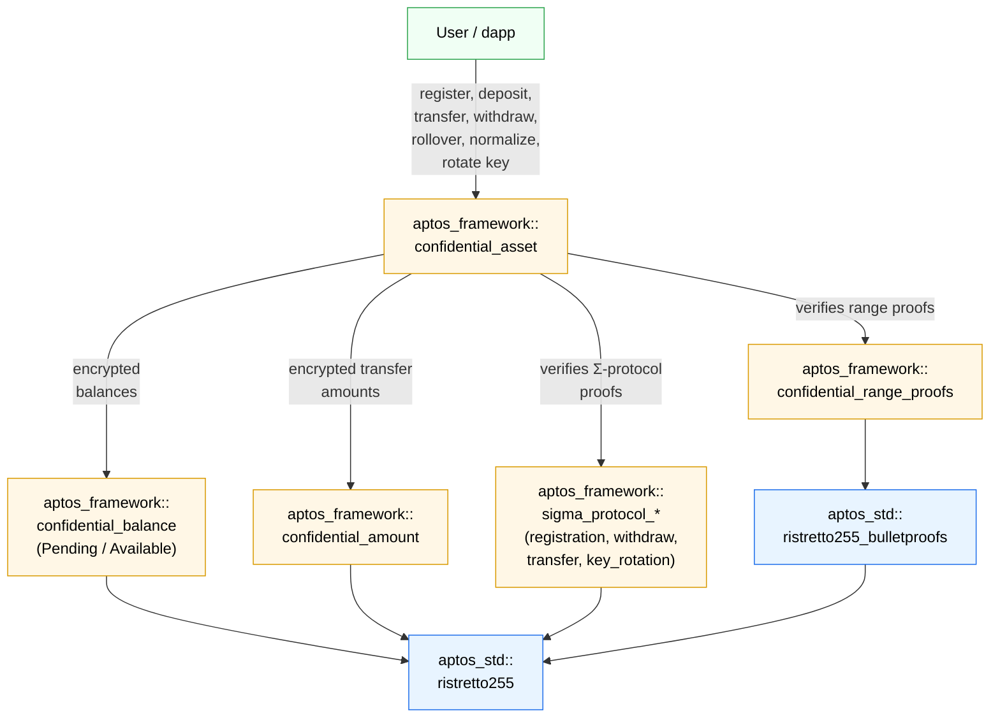

import { Aside } from '@astrojs/starlight/components';

The **Confidential Asset (CA)** standard allows any fungible asset (FA) type to be wrapped into a variant with certain **confidentiality** features.

Namely, it allows users to establish a **confidential balance** and later **confidentially-transfer** <u>hidden</u> amounts from their confidential balance to another user's confidential balance.
Importantly, such confidential transfers completely hide the transferred amount from everyone, including from Aptos validators.
By design, a key limitation of CAs is that they do **not** hide the sender and recipient addresses.

CAs leverage **zero-knowledge proofs (ZKPs)** to enable Aptos validators to verify transaction correctness without revealing the hidden transferred amounts nor the confidential balances of the sender and recipient.

<Aside type="note">
  Interacting directly with Confidential Asset's smart contracts is highly complex.
  Developers are encouraged to use the TypeScript SDK, with full documentation available [here](/build/sdks/ts-sdk/confidential-asset).
  The SDK handles ZKP generation, balance decryption, and transaction construction.
</Aside>

<Aside type="tip">
  For how confidential transfers compare with ordinary payments on latency and fees, see [Payments](/build/guides/payments#confidential-transfers).
</Aside>

<Aside type="note">
  This documentation explains the contract's operations and offers insights into the core protocol.
  Cryptographic and mathematical details are explained superficially.
</Aside>

## Confidential balance

Each confidential balance is split into two parts:

- **pending balance** — the received balance, accumulates all incoming deposits and confidential transfers.

- **available balance** — the spendable balance, used exclusively for sending outgoing transfers and withdrawing.

Both balances are encrypted with the user's **encryption key (EK)**, ensuring underlying amounts remain private.

<Aside type="note">
  This two-balance design protects against "front-running" attacks.
  If there were a single balance, an attacker could invalidate a user's in-flight ZKP by sending a small payment
  that changes the balance before the transaction lands.
</Aside>

### Chunks

Confidential balances handle token amounts by splitting them into smaller units called **chunks**.
Each chunk represents a portion of the total amount and is encrypted individually using the user's EK.
Each encrypted chunk consists of two elliptic curve points $(P, R)$ forming a **Twisted ElGamal ciphertext**.

| Confidential balance type | Chunks     | Max chunk size | Max encoded value |
| ------------------------- | ---------- | -------------- | ----------------- |
| pending                   | 4 × 16-bit | 32 bits        | $2^{64} - 1$      |
| available                 | 8 × 16-bit | 32 bits        | $2^{128} - 1$     |

Both balance types share a single `CompressedBalance<T>` struct, parameterized by a phantom marker (`Pending` or `Available`):

```move filename="confidential_balance.move"
struct Pending has drop {}
struct Available has drop {}

enum CompressedBalance<phantom T> has store, drop, copy {
    V1 {
        P: vector<CompressedRistretto>,
        R: vector<CompressedRistretto>,
        R_aud: vector<CompressedRistretto>,
    }
}
```

<Aside type="note">
  The `R_aud` field stores the [effective auditor](#auditors)'s $R$-components, enabling the auditor
  (if one is configured) to decrypt the encrypted balance. It is left empty when no effective auditor is set.
  Pending balances do not support auditor access, so their `R_aud` field is empty.
</Aside>

### Rollover

Funds in the pending balance cannot be spent directly — they must be **rolled over** into the available balance first. Additionally, the pending balance can only accumulate up to $2^{16}$ transfers before a rollover is enforced by the protocol.
Note that, by that point, pending balance chunks can reach up to 32 bits each.
Crucially, our design ensures that after rolling over into the available balance, the resulting available balance chunks also remain 32-bit.
This ensures decryption times are fast.

<Aside type="note">
  Rollovers are an artifact of our cryptographic design due to the choice of Twisted ElGamal as our encryption scheme.
  Although artificial, this constraint is one that Move developers must be aware of when building with confidential assets (CA).
</Aside>

### Normalization

After a rollover, the available balance must be **normalized** before further rollovers can occur.
Normalization re-packs available balance chunks that may have reached 32 bits back to 16-bit chunks.

Normalization serves two purposes:

1. **Keeps decryption efficient** — smaller chunks means faster decryption.
2. **Enables further rollovers** — rollovers require a normalized available balance. (Otherwise, available balance chunks would exceed 32 bits after a rollover.)

Transfers and withdrawals implicitly normalize the available balance.
Users only need to normalize their available balance [manually](#normalize) if the following conditions _all_ hold:

1. It is _not_ already normalized.
2. They need to call
   [`rollover_pending_balance`](#rollover-pending-balance) (or `rollover_pending_balance_and_pause`), which requires a normalized available balance first.

### Encryption and decryption

As hinted in the [Chunks](#chunks) section, encryption involves:

- Splitting the encrypted value into 16-bit chunks.
- Applying the user's EK to encrypt each chunk individually as a Twisted ElGamal ciphertext.

<Aside type="note">
  Our protocol uses Twisted ElGamal additively-homomorphic encryption, allowing some arithmetic operations on confidential balances without needing to decrypt them.
  This is essential for updating the receiver's pending balance during transfers.
  It is also essential for rollovers, where the user's pending balance is added to their available one.
</Aside>

Similarly, decryption involves:

- Applying the user's DK to decrypt each chunk.
- Solving a discrete logarithm (DL) problem for each chunk to recover the original values.
- Combining the recovered values to reconstruct the total amount.

## Confidential store

To use confidential balances, a user must first **register** a `ConfidentialStore` for that asset type (e.g., APT, USDC).

Registration requires generating a standalone keypair:

- An **encryption key (EK)** — stored on-chain in the `ConfidentialStore`; used by others to encrypt amounts for this user.
- A **decryption key (DK)** — kept securely by the user; used to decrypt balances and generate spend proofs.

<Aside type="danger">
  These keys are standalone and should not be confused with the user's Aptos account (signing) keys.
</Aside>

The `ConfidentialStore` is instantiated per `(user, asset_type)` pair and managed by the `confidential_asset` module.
By this point, all of its fields should be familiar:

```move filename="confidential_asset.move"
enum ConfidentialStore has key {
    V1 {
        pause_incoming: bool,
        normalized: bool,
        transfers_received: u64,
        pending_balance: CompressedBalance<Pending>,
        available_balance: CompressedBalance<Available>,
        ek: CompressedRistretto,
        auditor_hint: Option<EffectiveAuditorHint>,
    }
}
```

The `transfers_received` field counts the amount of incoming transfers so as to enforce rollovers when necessary.
The `pause_incoming` field allows a user to pause receiving payments, which in turn allows that user to rotate their EK/DK keypair.
The `auditor_hint` field is discussed [later on](#auditors).

## Architecture

The diagram below shows the relationship between Confidential Asset modules:



Users interact with the `confidential_asset` module to perform every protocol operation. That module
delegates to:

- `confidential_balance` — a single module that represents both `Pending` and `Available` encrypted
  balances via phantom-typed `CompressedBalance<T>` / `Balance<T>`.
- `confidential_amount` — encrypted transfer-amount ciphertexts (sender, recipient, effective auditor,
  and any voluntary auditors).
- `confidential_range_proofs` — batched Bulletproofs verification for the new-balance and amount
  range proofs.
- `sigma_protocol_*` — a family of $\Sigma$-protocol modules (`sigma_protocol_proof`,
  `sigma_protocol_registration`, `sigma_protocol_withdraw`, `sigma_protocol_transfer`,
  `sigma_protocol_key_rotation`, plus shared helpers in `sigma_protocol_utils`) that verify
  knowledge / consistency proofs accompanying each entry function.

Under the hood, all elliptic curve cryptography is based on Ristretto255 and is implemented on top of the `aptos_std::ristretto255`
and `aptos_std::ristretto255_bulletproofs` Move modules.

## Entry functions

<Aside type="note">
  Entry functions with the `_raw` suffix accept serialized cryptographic data as `vector<u8>` or `vector<vector<u8>>`.
  ZKP generation and data serialization are handled by the [TypeScript SDK](/build/sdks/ts-sdk/confidential-asset).
</Aside>

### Register

```move filename="confidential_asset.move"
public entry fun register_raw(
    sender: &signer,
    asset_type: Object<fungible_asset::Metadata>,
    ek: vector<u8>,
    sigma_proto_comm: vector<vector<u8>>,
    sigma_proto_resp: vector<vector<u8>>
)
```

Users must register a `ConfidentialStore` for each asset type they intend to transact with.
As part of this process, users generate a keypair (EK and DK) on their end and submit
a $\Sigma$-protocol proof of knowledge of the DK corresponding to the given EK.

<Aside type="note">
  The proof of knowledge is meant to prevent registering with an EK whose underlying DK the caller does not actually know, which would leave that caller locked out of their confidential assets.
  As a result, the encryption key _cannot_ be the identity (zero) point.

  {/* $EK = dk^{-1} H$ ==> if $EK$ = identity (i.e., $0 \cdot H$) then there is no dk such that $dk \cdot EK = H$ */}
</Aside>

When a `ConfidentialStore` is first registered, the confidential balance is set to zero for both the `pending_balance` and `available_balance`.
This is done by the contract encrypting the value zero and storing it.

<Aside type="note">
  Although it is recommended to generate a unique keypair for each asset type to enhance security,
  users are not restricted from reusing the same encryption key across multiple asset types if they prefer.
</Aside>

<Aside type="caution">
  Registration is expensive as it allocates new storage slots, which is more expensive than the verification of the $\Sigma$-protocol proof.
  Luckily, users need only register once per asset type.
</Aside>

On mainnet and testnet, the registered asset type must first be [allow-listed](#allow-list--asset-config) for confidential transfers by Aptos governance.
Currently, only APT is allow-listed.

Lastly, registration is rejected during an [emergency pause](#emergency-pause).

### Deposit

```move filename="confidential_asset.move"
public entry fun deposit(
    depositor: &signer,
    asset_type: Object<fungible_asset::Metadata>,
    amount: u64
)
```

The `deposit` function brings tokens into the protocol: it converts fungible assets into confidential assets by transferring the passed amount from the user's primary FA store to their own pending balance.
This function can only be called _after_ the user has set up their confidential store via [`register`](#register).

Note that the `amount` in this function is publicly visible, as adding new tokens to the protocol requires a normal FA transfer.
However, balances within the protocol become obfuscated through confidential transfers, ensuring privacy in subsequent transactions.

<Aside type="note">
  If you want to have a hidden amount from the beginning, use the `confidential_transfer_raw` function instead.
</Aside>

<Aside type="caution">
  Zero-value deposits are rejected (they would pointlessly increment the recipient's `transfers_received` counter).
  "Dispatchable" fungible asset types -- those with custom `withdraw`/`deposit`/`balance`/`supply` hooks -- are also
  rejected, since their dynamic behavior cannot be safely composed with encrypted balances.
</Aside>

### Roll over

```move filename="confidential_asset.move"
public entry fun rollover_pending_balance(
    sender: &signer,
    asset_type: Object<fungible_asset::Metadata>
)
```

```move filename="confidential_asset.move"
public entry fun rollover_pending_balance_and_pause(
    sender: &signer,
    asset_type: Object<fungible_asset::Metadata>
)
```

The `rollover_pending_balance` function adds the pending balance to the available one, resetting the pending balance to zero.
Rollover is required whenever a user wants to spend their pending funds. It is also enforced when the pending balance has accumulated $2^{16}$ transfers.
Rollover works without any cryptographic proofs by leveraging properties of our [homomorphic encryption scheme](#encryption-and-decryption).

The `rollover_pending_balance_and_pause` variant additionally pauses incoming transfers after the rollover,
which is useful when preparing for a [key rotation](#rotate-encryption-key).

<Aside type="note">
  You cannot spend money from the pending balance directly. It must be rolled over to the available balance first.
</Aside>

<Aside type="caution">
  The available balance must be [normalized](#normalization) before performing a rollover.
  If it is not normalized, you can use the [`normalize_raw`](#normalize) function to do so.
</Aside>

<Aside type="caution">
  Calling the `rollover_pending_balance` function in a separate transaction is crucial for preventing "front-running" attacks.
</Aside>

### Confidentially transfer

```move filename="confidential_asset.move"
public entry fun confidential_transfer_raw(
    sender: &signer,
    asset_type: Object<fungible_asset::Metadata>,
    to: address,
    new_balance_P: vector<vector<u8>>,
    new_balance_R: vector<vector<u8>>,
    new_balance_R_eff_aud: vector<vector<u8>>,
    amount_P: vector<vector<u8>>,
    amount_R_sender: vector<vector<u8>>,
    amount_R_recip: vector<vector<u8>>,
    amount_R_eff_aud: vector<vector<u8>>,
    ek_volun_auds: vector<vector<u8>>,
    amount_R_volun_auds: vector<vector<vector<u8>>>,
    zkrp_new_balance: vector<u8>,
    zkrp_amount: vector<u8>,
    sigma_proto_comm: vector<vector<u8>>,
    sigma_proto_resp: vector<vector<u8>>,
    memo: vector<u8>
)
```

The `confidential_transfer_raw` function is the most complex function in the confidential asset module.
It transfers tokens from the sender's available balance to the recipient's pending balance, without leaking the transferred amount.
Namely, the sender encrypts the transferred amount under the recipient's encryption key, enabling the recipient's confidential balance to be updated [homomorphically](#homomorphic-encryption).

The transfer amount is also encrypted under the sender's key (for the sender's records) and under any auditor keys.

The function requires many parameters:

- **New balance ciphertexts** (`new_balance_P`, `new_balance_R`, `new_balance_R_eff_aud`): the sender's updated available balance after the transfer.
- **Amount ciphertexts** (`amount_P`, `amount_R_sender`, `amount_R_recip`, `amount_R_eff_aud`): the transfer amount encrypted under the sender's, recipient's, and auditor's keys.
- **Voluntary auditor keys and ciphertexts** (`ek_volun_auds`, `amount_R_volun_auds`): optional additional auditor encryption keys and amount ciphertexts.
- **Range proofs** (`zkrp_new_balance`, `zkrp_amount`): proving the new balance and transfer amount are non-negative and within range.
- **$\Sigma$-protocol proof** (`sigma_proto_comm`, `sigma_proto_resp`): proving the correctness of the transfer.

<Aside type="caution">
  Creating transactions that call `confidential_transfer_raw` can be cumbersome due to the many necessary ciphertext and proof parameters.
  Developers should use the [TypeScript SDK](/build/sdks/ts-sdk/confidential-asset) for this, which will generate all these on the user's behalf.
</Aside>

Optionally, the sender can specify a **memo** (`memo`): an opaque byte string emitted in the `Transferred` event, limited to `get_max_memo_bytes()` (256 bytes).
The memo is stored on-chain in plaintext, so the sender may want to encrypt it client-side if it is sensitive.

<Aside type="note">
  Once a user has participated in at least one transfer, their balance becomes "hidden".
  This means that neither the transferred amount nor the updated balances of the sender and recipient are visible to external observers.
</Aside>

<Aside type="caution">
  Self-transfers (where the sender is the recipient) are rejected.
</Aside>

### Withdraw

```move filename="confidential_asset.move"
public entry fun withdraw_to_raw(
    sender: &signer,
    asset_type: Object<fungible_asset::Metadata>,
    to: address,
    amount: u64,
    new_balance_P: vector<vector<u8>>,
    new_balance_R: vector<vector<u8>>,
    new_balance_R_aud: vector<vector<u8>>,
    zkrp_new_balance: vector<u8>,
    sigma_proto_comm: vector<vector<u8>>,
    sigma_proto_resp: vector<vector<u8>>
)
```

The `withdraw_to_raw` function allows a user to withdraw tokens from the protocol,
transferring the passed amount from the available balance of the sender to the primary FA store of the recipient.
This function enables users to release tokens while not revealing their remaining balances.

The withdrawn amount itself is publicly visible (as a `u64`), but the sender's remaining balance stays hidden.

<Aside type="caution">
  Attempting to withdraw more tokens than available will make this function abort.
</Aside>

### Rotate encryption key

```move filename="confidential_asset.move"
public entry fun rotate_encryption_key_raw(
    sender: &signer,
    asset_type: Object<fungible_asset::Metadata>,
    new_ek: vector<u8>,
    resume_incoming_transfers: bool,
    new_R: vector<vector<u8>>,
    sigma_proto_comm: vector<vector<u8>>,
    sigma_proto_resp: vector<vector<u8>>
)
```

The `rotate_encryption_key_raw` function modifies the user's EK and re-encrypts the available balance $R$-components with the new EK.
The `resume_incoming_transfers` parameter controls whether incoming transfers are unpaused after the rotation.

To facilitate the rotation process:

1. The pending balance must first be rolled over and [incoming transfers paused by calling `rollover_pending_balance_and_pause`](#unpause-incoming-transfers).
   This prevents new transfers from altering the pending balance during the key rotation.
2. Then the EK can be rotated using `rotate_encryption_key_raw`, optionally resuming incoming transfers.

<Aside type="caution">
  Key rotation requires incoming transfers to be paused. If they are not paused, the transaction will fail.
</Aside>

### Normalize

```move filename="confidential_asset.move"
public entry fun normalize_raw(
    sender: &signer,
    asset_type: Object<fungible_asset::Metadata>,
    new_balance_P: vector<vector<u8>>,
    new_balance_R: vector<vector<u8>>,
    new_balance_R_aud: vector<vector<u8>>,
    zkrp_new_balance: vector<u8>,
    sigma_proto_comm: vector<vector<u8>>,
    sigma_proto_resp: vector<vector<u8>>
)
```

The `normalize_raw` function ensures that the available balance is reduced to 16-bit chunks for [efficient decryption](#normalization).
This is necessary only before the `rollover_pending_balance` operation, which requires the available balance to be normalized beforehand.

All other functions, such as `withdraw_to_raw` or `confidential_transfer_raw`, handle normalization implicitly, making manual normalization unnecessary in those cases.

<Aside type="caution">
  Calling `rollover_pending_balance` when the available balance is not normalized will lead to an abort.
</Aside>

### (Un)pause incoming transfers

```move filename="confidential_asset.move"
public entry fun set_incoming_transfers_paused(
    owner: &signer,
    asset_type: Object<fungible_asset::Metadata>,
    paused: bool
)
```

The `set_incoming_transfers_paused` function allows a user to pause or unpause incoming confidential transfers.
When paused, other users cannot transfer tokens to this user's pending balance.

This is primarily used during [key rotation](#rotate-encryption-key) to ensure
the pending balance remains empty while the rotation is in progress.

## Governance

The following protocol-wide settings are controlled by Aptos governance (via an `aptos_framework` signer):

| Setting                                 | Effect                                                              |
| --------------------------------------- | ------------------------------------------------------------------- |
| [Global auditor](#auditors)             | Mandatory auditor for all assets without an asset-specific override |
| [Asset-specific auditor](#auditors)     | Per-token mandatory auditor; overrides the global auditor           |
| [Allow list](#allow-list--asset-config) | Only allow-listed FA types can use CA; withdrawals always permitted |
| [Emergency pause](#emergency-pause)     | Halts all user operations                                           |

Details for each setting are in the sections below.

### Auditors

There are three types of auditors:

- **Global auditor** — set by governance, applies to all asset types unless overridden 👇
- **Asset-specific auditor** — set by governance per asset type. Takes precedence over the global auditor for that asset only.
- **Voluntary auditors** — extra auditors, voluntarily-specified by the sender at transfer time.

Since an asset-specific auditor supersedes the global auditor, it is useful to talk about the **effective auditor** for an asset type: i.e., the _asset-specific auditor_, if set, or the _global auditor_, if set, or, nothing.

Auditors have their own Twisted ElGamal keypair and have the power to:

1. decrypt transfer amounts from confidential transfers, which additionally encrypt the transferred amount for the _effective auditor_ (and for the _voluntary auditors_)
2. decrypt available balances of any user (does not apply to _voluntary auditors_, who can only see the transferred amount)

<Aside type="note">
  To summarize, the effective auditor (for an asset type) can decrypt both the transfer amount and the user's available balance (for that asset type).
  Voluntary auditors can only decrypt the transfer amount.
</Aside>

<Aside type="note">
  Asset-specific and global auditors are managed via the governance functions
  `set_asset_specific_auditor` and `set_global_auditor`.
</Aside>

The auditor configuration is wrapped in `AuditorConfig`, which bundles the EK with an `epoch` counter that
increments every time the auditor is installed or rotated (it does not increment when the auditor is removed):

```move filename="confidential_asset.move"
enum AuditorConfig has store, drop, copy {
    V1 {
        ek: Option<CompressedRistretto>,
        epoch: u64,
    }
}

enum EffectiveAuditorConfig has store, drop, copy {
    V1 { is_global: bool, config: AuditorConfig }
}

enum EffectiveAuditorHint has store, drop, copy {
    V1 { is_global: bool, epoch: u64 }
}
```

Each `ConfidentialStore` records an `EffectiveAuditorHint` alongside its `available_balance`, so an auditor
can compare `(is_global, epoch)` against the current effective auditor config and tell whether their copy
of a balance ciphertext is stale.

### Allow listing

On mainnet and testnet, the protocol enforces an asset-type **allow list**: only asset types explicitly
allow-listed by governance can be registered, deposited, transferred, or rolled over confidentially.
Withdrawals are always permitted — even when an asset is removed from the allow list — so users can
recover funds.

Allow-listing and per-asset configuration are managed by governance via the following (non-`entry`) functions:

#### set\_allow\_listing

Enables or disables the allow list globally.

```move filename="confidential_asset.move"
public fun set_allow_listing(
    aptos_framework: &signer,
    enabled: bool
)
```

#### set\_confidentiality\_for\_asset\_type

Enables or disables confidential transfers for a specific asset type. Only callable when the allow list is enabled; aborts with `E_ALLOW_LISTING_IS_DISABLED` otherwise.

```move filename="confidential_asset.move"
public fun set_confidentiality_for_asset_type(
    aptos_framework: &signer,
    asset_type: Object<fungible_asset::Metadata>,
    allowed: bool
)
```

#### set\_confidentiality\_for\_apt

Convenience wrapper that calls `set_confidentiality_for_asset_type` for the APT token.

```move filename="confidential_asset.move"
public fun set_confidentiality_for_apt(
    aptos_framework: &signer,
    allowed: bool
)
```

### Emergency pause

Governance can pause **all** user-facing operations (`register`, `deposit`, `withdraw`, `confidential_transfer`,
`normalize`, `rollover_pending_balance`, `rotate_encryption_key`, `set_incoming_transfers_paused`) via:

```move filename="confidential_asset.move"
public fun set_emergency_paused(aptos_framework: &signer, paused: bool)
```

While paused, every user operation aborts with `E_EMERGENCY_PAUSED`. Use the
[`is_emergency_paused`](#view-functions) view function to check the current state before
constructing transactions.

## View functions

#### Protocol status

Whether governance has engaged the [emergency pause](#emergency-pause).

```move filename="confidential_asset.move"
#[view]
public fun is_emergency_paused(): bool
```

Whether the [allow list](#allow-listing) is enabled.

```move filename="confidential_asset.move"
#[view]
public fun is_allow_listing_required(): bool
```

Whether the asset type is allow-listed for confidential use.

```move filename="confidential_asset.move"
#[view]
public fun is_confidentiality_enabled_for_asset_type(
    asset_type: Object<fungible_asset::Metadata>
): bool
```

#### Confidential store queries

Whether a confidential store exists for `(user, asset_type)`.

```move filename="confidential_asset.move"
#[view]
public fun has_confidential_store(
    user: address,
    asset_type: Object<fungible_asset::Metadata>
): bool
```

User's current encryption key for an asset type.

```move filename="confidential_asset.move"
#[view]
public fun get_encryption_key(
    user: address,
    asset_type: Object<fungible_asset::Metadata>
): CompressedRistretto
```

Whether the available balance is in 16-bit normal form.

```move filename="confidential_asset.move"
#[view]
public fun is_normalized(
    user: address,
    asset_type: Object<fungible_asset::Metadata>
): bool
```

Whether incoming transfers are paused.

```move filename="confidential_asset.move"
#[view]
public fun incoming_transfers_paused(
    user: address,
    asset_type: Object<fungible_asset::Metadata>
): bool
```

Number of pending transfers since last rollover.

```move filename="confidential_asset.move"
#[view]
public fun get_num_transfers_received(
    user: address,
    asset_type: Object<fungible_asset::Metadata>
): u64
```

#### Balance queries

Encrypted pending balance.

```move filename="confidential_asset.move"
#[view]
public fun get_pending_balance(
    owner: address,
    asset_type: Object<fungible_asset::Metadata>
): CompressedBalance<Pending>
```

Encrypted available balance.

```move filename="confidential_asset.move"
#[view]
public fun get_available_balance(
    owner: address,
    asset_type: Object<fungible_asset::Metadata>
): CompressedBalance<Available>
```

Total tokens currently locked in all confidential stores for this asset type.

```move filename="confidential_asset.move"
#[view]
public fun get_total_confidential_supply(
    asset_type: Object<fungible_asset::Metadata>
): u64
```

#### Auditor queries

Which [auditor](#auditors) (global/asset-specific) and epoch the user's balance ciphertext is encrypted for.

```move filename="confidential_asset.move"
#[view]
public fun get_effective_auditor_hint(
    user: address,
    asset_type: Object<fungible_asset::Metadata>
): Option<EffectiveAuditorHint>
```

The effective auditor config (asset-specific if set, otherwise global).

```move filename="confidential_asset.move"
#[view]
public fun get_effective_auditor_config(
    asset_type: Object<fungible_asset::Metadata>
): EffectiveAuditorConfig
```

#### Constants

Maximum pending transfers before rollover is enforced (65,536).

```move filename="confidential_asset.move"
#[view]
public fun get_max_transfers_before_rollover(): u64
```

Maximum memo length in bytes (256).

```move filename="confidential_asset.move"
#[view]
public fun get_max_memo_bytes(): u64
```

## Limitations

- **Dispatchable FAs not supported.** Only non-dispatchable Fungible Assets can be used with CA. FAs with custom `withdraw`/`deposit`/`balance`/`supply` dispatch functions are rejected at every operation (registration, deposit, withdrawal, and transfer).
- **Addresses are public.** Sender and recipient addresses appear in plaintext in every transaction. Only the transferred amounts and balances are hidden.
- **Total supply is public.** The total number of tokens currently locked across all confidential stores for an asset type is queryable via `get_total_confidential_supply`.

## Useful resources

- [Confidential Asset SDK](/build/sdks/ts-sdk/confidential-asset)
