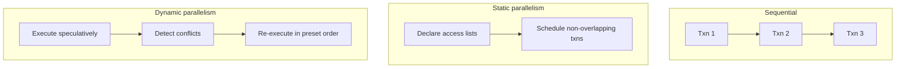

On Aptos, **execution** is the step where validators apply an ordered block of transactions to ledger state. The output must be [deterministic](https://en.wikipedia.org/wiki/Deterministic_algorithm): honest validators that start from the same state and the same block must produce the same write set.

A supermajority of voting power (more than two-thirds) must agree on that result before the block commits. See [BFT](/network/glossary#byzantine-fault-tolerance-bft) and [consensus](/network/glossary#consensus).

Execution speed shows up as block time. Aptos does not wait on a fixed slot clock; it proposes the next block as soon as the network allows. Mainnet block times are typically tens of milliseconds. See [Blocks](/network/blockchain/blocks).

## Why parallel execution?

Executing a block one transaction at a time is simple and does not scale. Long transactions stall everything behind them, so latency and throughput collapse under load.

Parallel execution runs many transactions at once. The hard part is conflicts: two transactions that read or write the same resource cannot both commit as if they ran alone in the wrong order.

### Static parallelism

**Static parallelism** asks developers (or the runtime, from annotations) to declare which data each transaction will touch. The scheduler then runs non-overlapping transactions together.

That shifts the burden onto application authors. Declared sets are often wider than the data a transaction actually uses, so independent work is forced to run serially.

### Dynamic parallelism

**Dynamic parallelism** finds conflicts at runtime. Transactions execute speculatively; if two of them collide, the engine re-executes the later one. The committed result must still match executing the block in the **preset consensus order**.

Developers do not declare access lists. They write ordinary Move, and the engine parallelizes whatever does not conflict.

## Block-STM

Aptos executes blocks with **Block-STM**, a multi-threaded, in-memory engine that combines software transactional memory with a collaborative scheduler. It uses the consensus order as the serial baseline, executes transactions in parallel, and re-executes only the ones that aborted because of a conflict.

Block-STM is the dynamic-parallelism engine originally built by Aptos Labs. [Polygon](https://polygon.technology/blog/innovating-the-main-chain-a-polygon-pos-study-in-parallelization), Sei, [Starknet](https://www.starknet.io/blog/parallel-execution-and-v0-13-2/), and other chains have adopted the same approach.

To learn more:

- [Block-STM blog post](https://medium.com/aptoslabs/block-stm-how-we-execute-over-160k-transactions-per-second-on-the-aptos-blockchain-3b003657e4ba)
- [Block-STM paper](https://arxiv.org/pdf/2203.06871)
- [a16z crypto research talk](https://www.youtube.com/watch?v=2SE5tqPzhyw)
- [Stark Spaces | Block-STM and Starknet](https://www.youtube.com/watch?v=y1kXOi39RX0)
- [Block-STM: Accelerating Smart-Contract Processing](https://blog.chain.link/block-stm/)
- [Transactions and States](/network/blockchain/txns-states) — how execution writes versioned ledger state
- [Computing Transaction Gas](/network/blockchain/base-gas) — how execution and IO are metered
