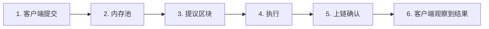
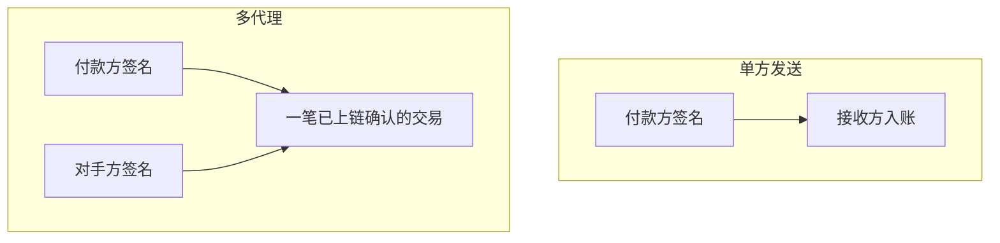
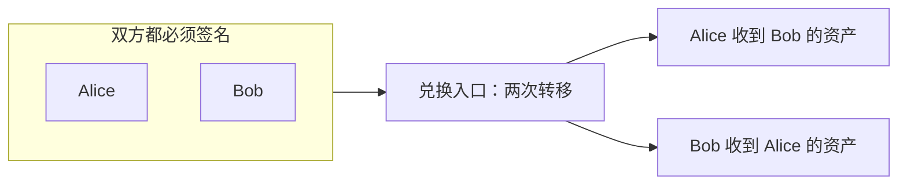

import { Aside, CardGrid, LinkCard } from "@astrojs/starlight/components";

Aptos 是一条用于转移 APT、[稳定币](/zh/build/guides/exchanges#稳定币地址) 和其他[同质化资产](/zh/build/smart-contracts/fungible-asset) 的 Layer 1 结算轨道。支付交易在**上链确认（commit）且执行成功**后即具有最终性（BFT 共识，无需额外区块确认）。本页把出块时间、端到端延迟、最终性和手续费分开说明，再对应到普通转账、机密转账和其他支付流程。

一笔支付可以是「单方发送」（付款方签名，接收方不必签名），也可以是一笔[多代理交易](#双方同意多代理交易)，由双方共同签名，在一次原子上链确认中达成同意。[赞助交易](/zh/build/guides/sponsored-transactions)（由另一账户支付 gas）和[无序交易](/zh/build/guides/orderless-transactions)（用 nonce 代替序列号，可并行提交）可以与上述任意形态组合。

<Aside type="tip">
  要发出第一笔可用的支付，请跟随[您的第一笔交易](/zh/build/guides/first-transaction)。钱包和已有应用请参阅[应用集成](/zh/build/guides/application-integration)。
</Aside>

## 延迟、出块时间与手续费

这四个数字回答不同的问题。不要把出块时间当成用户等待支付完成的时间。



| 指标             | 衡量内容                                     | 主网典型值                                                                                                                   | 如何核验                                                                                                  |
| -------------- | ---------------------------------------- | ----------------------------------------------------------------------------------------------------------------------- | ----------------------------------------------------------------------------------------------------- |
| **出块时间**       | 相邻区块的间隔                                  | 数十毫秒。Aptos 不使用固定槽位时钟；实时时间戳常低于 50 ms                                                                                     | [区块](/zh/network/blockchain/blocks)、[Explorer](https://explorer.aptoslabs.com/blocks?network=mainnet) |
| **最终性**        | 已上链结果何时不可逆                               | [上链确认后立即最终](/zh/build/guides/exchanges#交易何时具有终局性)。无需确认深度，也没有重组窗口。失败的交易同样最终，只是资金没有转移                                     | [交易和状态](/zh/network/blockchain/txns-states)                                                           |
| **端到端（E2E）延迟** | 客户端**提交** → `waitForTransaction` 返回已上链交易 | 正常负载下通常为**亚秒级**。包含到全节点的客户端往返、内存池、共识、执行和轮询。构建、签名和证明生成发生在提交之前，不计入该数字                                                      | 提交后务必调用 `waitForTransaction`                                                                          |
| **交易手续费**      | 向费用支付者收取的 APT                            | 净扣费为 `gas_used × gas_unit_price − storage_refund`（以 [Octa](/zh/network/glossary#octa) 计）。存储费已经折进 `gas_used`。**与转账金额无关** | [Gas 和存储费用](/zh/network/blockchain/gas-txn-fee)                                                       |

<Aside type="note">
  出块时间、网络负载以及以美元计价的手续费会随网络和 APT 价格变化。产品 SLA 请引用 Octa（或模拟得到的 `gas_used`）；美元数字仅作数量级参考。实时 gas 单价见 [`/v1/estimate_gas_price`](https://api.mainnet.aptoslabs.com/v1/estimate_gas_price)。治理设置下限（`txn.min_price_per_gas_unit`，普通交易当前为 100 Octa）。
</Aside>

### 出块时间

验证者在网络时延允许时就会提议下一个区块。主网出块时间通常为数十毫秒。这是链打包交易的速度，不是钱包在展示「已支付」之前应等待的时间。

详见[区块](/zh/network/blockchain/blocks)和[执行](/zh/network/blockchain/execution)（Block-STM）。

### 端到端延迟

本页的 **E2E 延迟** 是从**提交**到 `waitForTransaction` 返回已上链交易的时钟。简单支付的这一等待通常不到一秒。

提交到节点之前的工作是另一段时钟，常常主导用户感知时延：

- 构建、可选的模拟、签名。
- 机密资产证明生成、收集多签签名，或加密待处理负载。

提交不等于结算。返回 202 和哈希只表示节点**接受**了交易。用 `waitForTransaction` 轮询，并在 `success === true` 时才把支付视为完成。已上链但失败的交易仍然具有[最终性](#最终性)（不会被撤销），但转账并未发生。

### 最终性

Aptos 使用 BFT 共识。已上链确认的交易即最终，无论成功还是失败。你不必像在概率最终性链上那样再等若干区块。见[交易所常见问题中的终局性](/zh/build/guides/exchanges#交易何时具有终局性)以及[交易生命周期](/zh/network/blockchain/blockchain-deep-dive)。

### 交易手续费

手续费包含两部分，详见 [Gas 和存储费用](/zh/network/blockchain/gas-txn-fee)。当前客户端仍在 `gas_used` 中看到它们的合计：

1. **执行与 IO** — gas 单位 × `gas_unit_price`（Octa）。单价可在负载升高时上涨；更高价格只帮助交易**进入**下一个区块，而不改变它在区块内的顺序。
2. **存储** — 为新建或增大的状态槽支付固定 APT（例如接收方第一次持有某种同质化资产）。该金额按交易的 `gas_unit_price` 折成 gas 单位并计入 `gas_used`。删除状态时可能产生 `storage_refund`，该退款**不在** `gas_used` 内。

支付者净扣 APT 为 `gas_used × gas_unit_price − storage_refund`。同样的负载下，转 1 APT 与转 1,000,000 APT 的 gas 成本几乎相同。主网平均手续费处于**不到 1 美分**的量级（公开网络数据大约为 0.0005 美元，仅作数量级参考）。简单的 APT 和同质化资产转账属于最便宜的交易之列。请始终针对你将提交的准确负载做模拟。

若要让终端用户不持有 APT，使用[赞助交易](/zh/build/guides/sponsored-transactions)或 [Geomi Gas Station](https://geomi.dev/docs/gas-stations)。

## 按用法划分的支付

用下表选择 API，并查看延迟和手续费如何变化。机密转账在此只做摘要；协议细节见机密资产页面。赞助、无序和多代理是交易层选项，可与每一行组合，见[组合每一种支付](#组合每一种支付)。

| 用法                | 典型链上 E2E            | 额外的客户端工作          | 手续费特征                                      | 实现                                                             |
| ----------------- | ------------------- | ----------------- | ------------------------------------------ | -------------------------------------------------------------- |
| **APT 转账**        | 提交后亚秒级              | 签名、提交、等待          | 最低。与金额无关                                   | [`0x1::aptos_account::transfer`](#apt-转账)                      |
| **同质化资产 / 稳定币转账** | 与 APT 相同            | 签名、提交、等待          | 与 APT 相近。若接收方尚无主存储则含存储费                    | [`0x1::primary_fungible_store::transfer`](#同质化资产与稳定币转账)        |
| **机密转账**          | 相同的上链确认路径；执行更重、负载更大 | 在提交之前生成零知识证明      | 高于明文转账                                     | [机密资产](/zh/build/smart-contracts/confidential-asset)（不要根据本页实现） |
| **加密待处理负载**       | 上链确认后相同             | 构建时加密             | `gas_unit_price` 最低为 **200** Octa（普通下限的两倍） | [加密待处理交易](/zh/build/guides/encrypted-pending-transactions)     |
| **金库 / 策略**       | 批准带来额外往返            | 收集 N-of-M 签名      | 批准后收取一次执行费                                 | [您的第一个多签](/zh/build/guides/first-multisig)                     |
| **无密码登录**         | 与内部转账相同             | OIDC / Keyless 流程 | 与内部转账相同                                    | [Aptos 无密钥](/zh/build/guides/aptos-keyless)                    |
| **双方同意**          | 收齐签名后与内部转账相同        | 向每个代理收集签名         | 与内部调用的链上成本相同                               | [多代理交易](#双方同意多代理交易)                                            |
| **点对点兑换**         | 双方签名后与内部转账相同        | 双方签署同一负载          | 两条腿的 gas 计入一笔交易                            | [点对点兑换](#点对点兑换)                                                |

批量打款（工资、分发）可以使用 `0x1::aptos_account::batch_transfer` / `batch_transfer_coins`，用一笔交易支付多名接收方。gas 随输出数量增加，但端到端仍只需等待一次。

## 组合每一种支付

支付本身是 Move 调用（APT、FA、机密资产、NFT 等）。以下三个选项挂在交易层，并且可以彼此叠加：

1. **[赞助交易](/zh/build/guides/sponsored-transactions)**：由另一账户支付 gas。构建时设置 `withFeePayer: true`；发送方调用 `.sign`，赞助方调用 `.signAsFeePayer`。链上成本相同，只是扣费对象换成费用支付者。[Geomi Gas Station](https://geomi.dev/docs/gas-stations) 是托管的费用支付者。
2. **[无序交易](/zh/build/guides/orderless-transactions)**（AIP-123）：传入唯一的 `replayProtectionNonce` 代替序列号，使同一账户可以并行提交多笔支付（工资、热钱包）。无序交易最多 60 秒过期。序列号工作流仍是默认选择，见[交易管理](/zh/build/guides/transaction-management)。
3. **[多代理](#双方同意多代理交易)**：列出的每个账户都对同一笔交易签名，从而让双方同意，而不是由一方单方面发给另一方。需要带有多个 `&signer` 参数的 Move 入口函数。不同于多签（对同一个账户的 N-of-M 控制）。

| 支付           | 赞助                                 | 无序                           | 多代理（双方同意）                                          |
| ------------ | ---------------------------------- | ---------------------------- | -------------------------------------------------- |
| **APT**      | 费用支付者承担 gas，转出的 APT 不被手续费扣减        | 同一热钱包并行打款                    | 自定义双签名[兑换](#点对点兑换)模块，不要用 `aptos_account::transfer` |
| **FA / 稳定币** | 用户持有 FA，应用支付 APT gas               | 同样的并行提交                      | [点对点兑换](#点对点兑换)：双方签署同一入口函数，同时转移双方资产                |
| **机密**       | CA 客户端 `withFeePayer: true`（全局或按次） | 自行构建 CA 负载时可使用 nonce         | 标准 CA 转账是单方发送；双方同意需要自定义合约                          |
| **加密待处理**    | 可组合（`withFeePayer: true`）          | 可组合（`replayProtectionNonce`） | 可组合（`build.multiAgent`）                            |
| **NFT / 对象** | 与 APT 或 FA 相同的费用支付者模式              | 同样的并行提交                      | 双方签名的对象换代币                                         |
| **金库 / 多签**  | N-of-M 批准后仍可由赞助方支付 gas             | 金库并行操作可用无序                   | 另一套工具：两个账户，而不是一个账户上的多把密钥                           |
| **无密钥**      | 赞助 gas，新用户无需持有 APT                 | 与其他发送方相同的 nonce 选项           | 无密钥账户可作为发送方或二级签名者                                  |

在单方 APT（或 FA）转账上叠加赞助与无序：

```typescript filename="sponsored-orderless-apt.ts"
const transaction = await aptos.transaction.build.simple({
  sender: sender.accountAddress,
  withFeePayer: true,
  data: {
    function: "0x1::aptos_account::transfer",
    functionArguments: [recipientAddress, amountInOctas],
  },
  options: {
    replayProtectionNonce: nonce, // 唯一的 u64；省略该字段则使用序列号
  },
});

const senderAuthenticator = aptos.transaction.sign({ signer: sender, transaction });
const feePayerAuthenticator = aptos.transaction.signAsFeePayer({ signer: feePayer, transaction });
const committed = await aptos.transaction.submit.simple({
  transaction,
  senderAuthenticator,
  feePayerAuthenticator,
});
```

FA 转账只需更换 `function`（及参数）。双方支付请使用 `build.multiAgent` / `submit.multiAgent`，并同样保留 `withFeePayer` 和 `replayProtectionNonce`。完整流程：[赞助](/zh/build/sdks/ts-sdk/building-transactions/sponsoring-transactions)、[无序](/zh/build/sdks/ts-sdk/building-transactions/orderless-transactions)、[多代理](/zh/build/sdks/ts-sdk/building-transactions/multi-agent-transactions)。

## APT 转账

使用 `0x1::aptos_account::transfer` 转移原生 APT。该函数会在需要时创建接收方账户资源。

```typescript filename="apt-transfer.ts"
const transaction = await aptos.transaction.build.simple({
  sender: sender.accountAddress,
  data: {
    function: "0x1::aptos_account::transfer",
    functionArguments: [recipientAddress, amountInOctas],
  },
});

const committed = await aptos.signAndSubmitTransaction({ signer: sender, transaction });
const executed = await aptos.waitForTransaction({ transactionHash: committed.hash });
if (!executed.success) {
  throw new Error(executed.vm_status);
}
```

完整流程（水龙头、模拟、签名、等待）见[您的第一笔交易](/zh/build/guides/first-transaction)。各 SDK 快速入门重复同一模式：[TypeScript](/zh/build/sdks/ts-sdk/quickstart)、[Python](/zh/build/sdks/python-sdk/quickstart)、[Go](/zh/build/sdks/go-sdk/quickstart)、[Rust](/zh/build/sdks/rust-sdk/quickstart)。

对于 Coin 类型资产（包括已迁移的 Coin），请优先使用 `0x1::aptos_account::transfer_coins` 而非 `0x1::coin::transfer`，以便自动注册接收方存储。见交易所指南中的[转移资产](/zh/build/guides/exchanges#转移资产)。

这些组合选项如何用于 APT：

- **赞助：** 费用支付者支付 gas，因此发送方转出的 APT 不会被手续费扣减。适合由金库或应用承担 gas，或希望接收方收到精确的 Octa 数量、发送方只支出该数量。
- **无序：** 为每笔打款使用唯一的 `replayProtectionNonce`，使同一热钱包可以一次提交多笔 APT 转账（工资、分发）。过期时间最多 60 秒。
- **多代理：** 单方 `aptos_account::transfer` 只需要发送方。若双方必须同意，尤其是[点对点兑换](#点对点兑换)，请使用带两个 `&signer` 参数的自定义入口函数。给 `0x1::aptos_account::transfer` 增加二级签名者会失败（`NUMBER_OF_SIGNER_ARGUMENTS_MISMATCH`）。见[双方同意](#双方同意多代理交易)。

## 同质化资产与稳定币转账

USDC、USDT 和当前其他代币使用[同质化资产](/zh/build/smart-contracts/fungible-asset)标准。使用 `0x1::primary_fungible_store::transfer` 转账。若接收方尚无主存储，该函数会创建它。

```typescript filename="fa-transfer.ts"
const transaction = await aptos.transaction.build.simple({
  sender: sender.accountAddress,
  data: {
    function: "0x1::primary_fungible_store::transfer",
    typeArguments: ["0x1::object::ObjectCore"],
    functionArguments: [metadataAddress, recipientAddress, amount],
  },
});

const committed = await aptos.signAndSubmitTransaction({ signer: sender, transaction });
const executed = await aptos.waitForTransaction({ transactionHash: committed.hash });
if (!executed.success) {
  throw new Error(executed.vm_status);
}
```

主网稳定币 metadata 地址列在[稳定币地址](/zh/build/guides/exchanges#稳定币地址)。更广的代币注册表见 [Panora Token List](https://github.com/PanoraExchange/Aptos-Tokens)。要发行自己的资产，从[您的第一个可替代资产](/zh/build/guides/first-fungible-asset)开始。

<Aside type="caution">
  第一次向某账户贷记某种 FA 可能分配存储槽。该存储费会折成 gas 单位并计入 `gas_used`（见 [Gas 和存储费用](/zh/network/blockchain/gas-txn-fee)）。请模拟确切的发送方/接收方组合，不要假设与重复转账成本相同。
</Aside>

读取余额请使用 `aptos.getBalance({ accountAddress, asset })` 或 `0x1::primary_fungible_store::balance` 视图函数。索引与产品表见 [Indexer](/zh/build/indexer) 和[同质化资产余额查询](/zh/build/indexer/indexer-api/fungible-asset-balances)。

这些组合选项如何用于 FA 和稳定币：

- **赞助：** 这是常见的免 gas 结账：用户持有 USDC（或其他 FA），不必持有 APT。应用或 [Geomi Gas Station](https://geomi.dev/docs/gas-stations) 支付 gas。与 APT 相同的 `withFeePayer: true` 模式，只换入口函数。
- **无序：** 与 APT 相同的 nonce。用于同一金库账户并行打出稳定币。
- **多代理：** 单方 `primary_fungible_store::transfer` 是付款方向接收方的推送。[点对点兑换](#点对点兑换)（USDC 换 APT、两种 FA，或货银对付）时，两个账户对同一个自定义入口函数签名，任何一方都不能声称对方已经先付了。

## 机密转账

[机密资产（CA）](/zh/build/smart-contracts/confidential-asset) 将同质化资产封装起来，使**金额和机密余额保持隐藏**（包括对验证者），并使用零知识证明。发送方和接收方**地址仍然可见**。入账资金进入待处理机密余额，必须[结转](/zh/build/smart-contracts/confidential-asset#余额结转)后才能花费。

不要手工构建 CA 交易。使用 [机密资产（SDK）](/zh/build/sdks/ts-sdk/confidential-asset) 中记录的 TypeScript 客户端。该包负责生成证明、解密余额并构造入口函数负载。

相对于明文 FA 转账：

- **E2E 延迟：** 提交之后的链上 E2E 通常仍为亚秒级。客户端上的证明生成发生在提交之前，这是常见的额外延迟。
- **手续费：** 因证明验证和更大负载，执行与 IO 更高。请模拟。除普通计量外，没有单独的「机密 gas 表」。
- **不同于加密待处理交易。** CA 隐藏已确认的金额。[加密待处理交易](/zh/build/guides/encrypted-pending-transactions) 仅在交易处于内存池时隐藏 Move 负载。

这些组合选项如何用于机密转账：

- **赞助：** CA TypeScript 客户端一等支持费用支付者：`new ConfidentialAsset({ config, withFeePayer: true })`，或在单次调用（`deposit`、`transfer`、`withdraw`、结转）上传入 `withFeePayer: true`。见[代付 Gas](/zh/build/sdks/ts-sdk/confidential-asset#代付-gas)。
- **无序：** 无序是交易层 nonce，不是 CA 协议特性。高层 CA 客户端记录了费用支付者，没有记录 `replayProtectionNonce`。若你自行构造 CA 入口函数负载（证明仍由 SDK 生成），可以像其他调用一样在 `build.simple` 上传入 `options.replayProtectionNonce`。除非同一账户要并行提交大量 CA 操作，否则优先使用序列号。
- **多代理：** `ca.transfer` 是单方发送：发送方生成证明并签名，接收方不必签名。入账资金仍进入接收方的待处理机密余额，必须结转后才能花费。双方同意的机密结算（金额移动前双方都必须同意）需要带两个 `&signer` 参数、并调用 CA 的自定义模块。不要把标准 CA 转账当成双方共同签名的支付。

## 双方同意（多代理交易）

单方支付是：Alice 签名，Bob 收款。Bob 并未在链上同意。结账、提现、工资推送适合这种形态。

**[多代理交易](/zh/build/sdks/ts-sdk/building-transactions/multi-agent-transactions)** 是另一种形态：Alice 和 Bob 都对同一笔交易签名。只有列出的每个账户都授权，Move 函数才会运行，因此两条腿要么都发生，要么都不发生。需要双方同意时使用：[点对点兑换](#点对点兑换)、托管释放、商户必须接受的退款，或任何不应由单方发送的支付。



这不是多签。多签是 N-of-M 密钥控制同一个账户（[您的第一个多签](/zh/build/guides/first-multisig)）。多代理是若干个不同账户出现在同一笔交易上。

框架里没有已经接受两个签名者的 `0x1` 支付函数。你需要发布（或复用）带有多个 `&signer` 参数的入口函数。最常见的支付形态就是兑换。

### 点对点兑换

两次单方发送无法实现兑换。若 Alice 先转出 USDC，Bob 可以拒绝再转 APT。若他们提交两笔独立交易，可能一笔上链成功、另一笔失败。多代理兑换把两次转移放进双方都签名的同一个 Move 函数：

1. Alice 和 Bob 在链下就资产和数量达成一致。这些值是双方共同签署的交易参数，任何一方都不能在对方签名之后改条件。
2. 入口函数把 Alice 的资产转给 Bob，同时把 Bob 的资产转给 Alice。
3. Block-STM 原子执行该函数。缺少任一签名则交易无效。函数中止（例如余额不足）时，两次转移都不上链。



这不是 AMM 或 DEX 兑换。资金池兑换通常是一个签名者对合约操作。多代理是两个账户彼此兑换（OTC、货银对付、NFT 换稳定币）。

发布一个模块：前两个参数为 `&signer`，并调用普通转账 API。交易中的签名者顺序必须与 Move 参数顺序一致：发送方是 `alice`，第一个二级签名者是 `bob`。

```move filename="p2p_swap.move"
module example::p2p_swap {
    use std::signer;
    use aptos_framework::object::Object;
    use aptos_framework::fungible_asset::Metadata;
    use aptos_framework::primary_fungible_store;

    /// Alice 把 `alice_amount` 的 `alice_asset` 转给 Bob。
    /// Bob 把 `bob_amount` 的 `bob_asset` 转给 Alice。
    /// 两次转移要么都发生，要么都不发生。
    public entry fun swap(
        alice: &signer,
        bob: &signer,
        alice_asset: Object<Metadata>,
        bob_asset: Object<Metadata>,
        alice_amount: u64,
        bob_amount: u64,
    ) {
        let alice_addr = signer::address_of(alice);
        let bob_addr = signer::address_of(bob);
        primary_fungible_store::transfer(alice, alice_asset, bob_addr, alice_amount);
        primary_fungible_store::transfer(bob, bob_asset, alice_addr, bob_amount);
    }
}
```

同样的模式可用于 APT 换稳定币（其中一条腿调用 `0x1::aptos_account::transfer`），或对象换 FA（NFT 结账）。两条腿都是 APT 时，教学脚本 [`two_by_two_transfer`](https://github.com/aptos-labs/aptos-ts-sdk/blob/main/tests/move/transfer/sources/script_two_by_two.move#L5) 就是对应的 Coin 示例。

```typescript filename="p2p-swap.ts"
const transaction = await aptos.transaction.build.multiAgent({
  sender: alice.accountAddress, // 第一个 &signer（alice）
  secondarySignerAddresses: [bob.accountAddress], // 第二个 &signer（bob）
  withFeePayer: true, // 可选：由应用支付 gas
  data: {
    function: "0xYOUR_MODULE::p2p_swap::swap",
    functionArguments: [aliceAssetMetadata, bobAssetMetadata, aliceAmount, bobAmount],
  },
  options: {
    replayProtectionNonce: nonce, // 可选；省略则使用序列号
  },
});

const aliceAuth = aptos.transaction.sign({ signer: alice, transaction });
const bobAuth = aptos.transaction.sign({ signer: bob, transaction });
const feePayerAuth = aptos.transaction.signAsFeePayer({ signer: feePayer, transaction });

const committed = await aptos.transaction.submit.multiAgent({
  transaction,
  senderAuthenticator: aliceAuth,
  additionalSignersAuthenticators: [bobAuth],
  feePayerAuthenticator: feePayerAuth,
});
```

兑换上的组合选项：

- **赞助：** 两条腿都是 FA、双方都不必为 gas 持有 APT 时很有用。费用支付者不是兑换的一方，除非你也把该账户列为签名者。
- **无序：** 同一发送方账户并行做多笔彼此独立的 OTC 兑换时使用 nonce。偶发兑换用序列号即可。
- **加密待处理：** 若约定数量应在内存池中保持隐藏，将 `encrypted: true` 与 `build.multiAgent` 一起使用。

其他 SDK 使用同样的 `multiAgent` 流程：[Python](/zh/build/sdks/python-sdk/building-transactions/multi-agent-transactions)、[Go](/zh/build/sdks/go-sdk/building-transactions/multi-agent-transactions)、[Rust](/zh/build/sdks/rust-sdk/building-transactions/multi-agent-transactions)。

## 其他支付用法

### 加密待处理负载

在执行前加密 Move 参数（[加密待处理交易](/zh/build/guides/encrypted-pending-transactions)，AIP-144）。目前在 devnet 和 testnet；最低 gas 单价 200 Octa。

- **赞助：** 在加密构建上传入 `withFeePayer: true`。SDK 将 `feePayerAuthenticationKey` 记为可选。
- **无序：** 同时传入 `replayProtectionNonce` 和 `encrypted: true`，使并行提交者仍能隐藏负载。
- **多代理：** `build.multiAgent` 接受 `encrypted: true` 以及可选的 `secondarySignerAuthenticationKeys`。在双方必须同意、且待处理负载应保持隐藏时使用。

### 金库与策略（多签）

铸造、冻结或大额打款的 N-of-M 控制：[您的第一个多签](/zh/build/guides/first-multisig)、[多签管理资产](/zh/build/guides/multisig-managed-fungible-asset)。

- **赞助：** 所有者批准之后，费用支付者仍可承担执行交易的 gas。
- **无序：** 金库账户并行提交多笔彼此独立的打款时使用 nonce。
- **多代理：** 不要用多代理替代多签。若金库必须与另一方一次结清，请收集多签签名以及对手方签名（多代理二级签名者），或让已批准的多签账户作为双签名模块中的一个代理。

### NFT 或对象结账

[数字资产](/zh/build/smart-contracts/digital-asset) 和[您的第一个 NFT](/zh/build/guides/your-first-nft)。结算仍使用相同的出块时间、最终性和手续费模型；负载是对象转移而非 FA 转账。

- **赞助：** 同样的 `withFeePayer` 模式，买家不必持有 APT。
- **无序：** 市场热钱包并行铸造或交付大量对象时使用同样的 nonce。
- **多代理：** 单方对象转移是推送。[NFT 换稳定币](#点对点兑换)且任何一方都不应先动时，买家与卖家对同一个入口函数签名。

### 无密码登录（Keyless）

[Aptos 无密钥](/zh/build/guides/aptos-keyless) 账户一旦创建，就是普通发送方。

- **赞助：** 代付 gas，使新用户可以用稳定币支付而从未持有 APT。
- **无序：** 与其他账户相同的 nonce 选项。
- **多代理：** 当用户必须与商户或另一钱包在一笔交易中达成同意时，无密钥账户可以作为发送方或二级签名者。

### 交易所与托管

充值、提现和最终性规则：[交易所集成](/zh/build/guides/exchanges)。

- **赞助：** 中心化交易所热钱包较少使用（场馆通常已持有 APT）。更适合面向用户的充值辅助或免 gas 提现领取。
- **无序：** 同一热钱包并行提现的常用工具；序列号工作流见[交易管理](/zh/build/guides/transaction-management)。
- **多代理：** 中心化交易所充值和提现是单方的。场馆与客户之间的 OTC 或链上货银对付可以使用多代理，让双方同意，而不是由一方发给另一方。

## 下一步

<CardGrid>
  <LinkCard href="/zh/build/guides/first-transaction" title="您的第一笔交易" description="为账户充值并发送一笔已验证的 APT 转账。" />

  <LinkCard href="/zh/build/smart-contracts/fungible-asset" title="同质化资产" description="USDC、USDT 和新支付资产使用的代币标准。" />

  <LinkCard href="/zh/build/smart-contracts/confidential-asset" title="机密资产" description="用零知识证明隐藏转账金额和机密余额。" />

  <LinkCard href="/zh/network/blockchain/gas-txn-fee" title="Gas 和存储费用" description="执行、IO 和存储费用如何计费与退款。" />

  <LinkCard href="/zh/build/guides/sponsored-transactions" title="赞助交易" description="让应用代付 gas，用户无需持有 APT 即可交易。" />

  <LinkCard href="/zh/build/guides/orderless-transactions" title="无序交易" description="用重放保护 nonce 从同一账户并行提交多笔支付。" />

  <LinkCard href="/zh/build/sdks/ts-sdk/building-transactions/multi-agent-transactions" title="多代理交易" description="双方共同签署一笔交易，而不是由一方发给另一方。" />

  <LinkCard href="/zh/build/guides/application-integration" title="应用集成" description="账户、签名、余额，以及提交后等待的生命周期。" />
</CardGrid>
