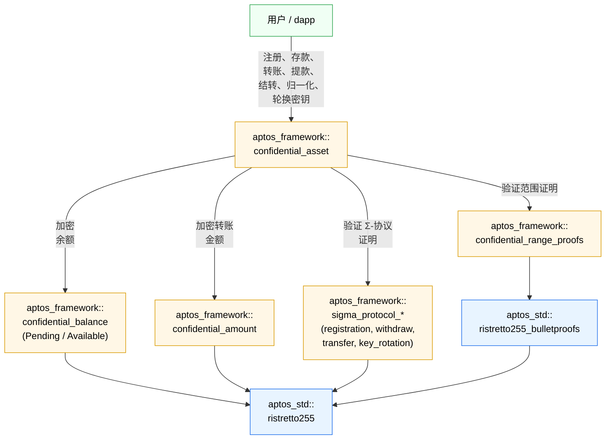

import { Aside } from '@astrojs/starlight/components';

**机密资产（Confidential Asset，CA）**标准允许将任何同质化资产（FA）类型封装为具有特定**保密**功能的变体。

具体而言，用户可以建立**机密余额**，随后从自己的机密余额向其他用户的机密余额进行金额<u>隐藏</u>的**机密转账**。
重要的是，此类机密转账会向包括 Aptos 验证者在内的所有人完全隐藏转账金额。
CA 的一个设计性限制是：它们**不会**隐藏发送方和接收方地址。

CA 使用**零知识证明（ZKP）**，让 Aptos 验证者能够验证交易的正确性，而无需泄露隐藏的转账金额，或发送方与接收方的机密余额。

<Aside type="note">
  直接与机密资产智能合约交互非常复杂。
  建议开发者使用 [TypeScript SDK](/zh/build/sdks/ts-sdk/confidential-asset)，其完整文档可在链接中查看。
  SDK 会处理 ZKP 生成、余额解密和交易构建。
</Aside>

<Aside type="tip">
  机密转账与普通支付在延迟和手续费上的对比，见[支付](/zh/build/guides/payments#机密转账)。
</Aside>

<Aside type="note">
  本文档说明合约操作，并介绍核心协议。
  其中仅简要说明密码学与数学细节。
</Aside>

## 机密余额

每个机密余额分为两部分：

- **待处理余额（pending balance）**：已接收的余额，累积所有传入的存款和机密转账。

- **可用余额（available balance）**：可花费的余额，仅用于发起转账和提款。

两个余额都使用用户的\*\*加密密钥（EK）\*\*加密，以确保底层金额保持私密。

<Aside type="note">
  此双余额设计可防范“抢先交易”（front-running）攻击。
  如果只有单一余额，攻击者可以发送一笔小额付款来改变余额，
  从而使用户正在提交的 ZKP 在交易落链前失效。
</Aside>

### 分块

机密余额会将代币金额拆分为称为\*\*块（chunk）\*\*的较小单元。
每个块代表总金额的一部分，并使用用户的 EK 单独加密。
每个加密块由两个椭圆曲线点 $(P, R)$ 组成，构成一个 **Twisted ElGamal 密文**。

| 机密余额类型 | 分块       | 最大块大小 | 最大编码值         |
| ------ | -------- | ----- | ------------- |
| 待处理余额  | 4 × 16 位 | 32 位  | $2^{64} - 1$  |
| 可用余额   | 8 × 16 位 | 32 位  | $2^{128} - 1$ |

两种余额类型共用同一个 `CompressedBalance<T>` 结构体，并通过虚类型标记（`Pending` 或 `Available`）参数化：

```move filename="confidential_balance.move"
struct Pending has drop {}
struct Available has drop {}

enum CompressedBalance<phantom T> has store, drop, copy {
    V1 {
        P: vector<CompressedRistretto>,
        R: vector<CompressedRistretto>,
        R_aud: vector<CompressedRistretto>,
    }
}
```

<Aside type="note">
  `R_aud` 字段存储[有效审计员](#审计员)的 $R$ 分量，使该审计员
  （如已配置）能够解密加密余额。未设置有效审计员时，该字段为空。
  待处理余额不支持审计员访问，因此其 `R_aud` 字段为空。
</Aside>

### 余额结转

待处理余额中的资金不能直接花费，必须先**结转**到可用余额。此外，待处理余额最多只能累积 $2^{16}$ 笔转账，之后协议会强制执行一次结转。
请注意，此时待处理余额中的块最大可达到 32 位。
关键在于，我们的设计确保结转到可用余额后，所得可用余额的块仍保持为 32 位。
这可确保较快的解密速度。

<Aside type="note">
  结转是我们因选择 Twisted ElGamal 作为加密方案而产生的密码学设计结果。
  尽管这是一个人为的限制，但使用机密资产（CA）构建应用的 Move 开发者必须了解它。
</Aside>

### 归一化

一次结转后，必须先将可用余额**归一化**，才能继续结转。
归一化会将可能已达到 32 位的可用余额块重新打包为 16 位块。

归一化有两个目的：

1. **保持解密高效**：较小的块意味着更快的解密。
2. **允许继续结转**：结转要求可用余额已归一化。（否则，结转后的可用余额块会超过 32 位。）

转账和提款会隐式地归一化可用余额。
仅当以下条件**全部**满足时，用户才需要[手动](#归一化)归一化可用余额：

1. 余额尚**未**归一化。
2. 用户需要调用
   [`rollover_pending_balance`](#余额结转)（或 `rollover_pending_balance_and_pause`），而该操作首先要求可用余额已归一化。

### 加密与解密

如[分块](#分块)一节所述，加密包括：

- 将待加密值拆分为 16 位块。
- 使用用户的 EK 将每个块单独加密为 Twisted ElGamal 密文。

<Aside type="note">
  本协议使用具有加法同态性的 Twisted ElGamal 加密，因此无需解密机密余额也可以执行部分算术操作。
  这对于在转账过程中更新接收方的待处理余额至关重要。
  对结转也同样至关重要，因为结转会将用户的待处理余额加到可用余额中。
</Aside>

类似地，解密包括：

- 使用用户的 DK 解密每个块。
- 对每个块求解离散对数（DL）问题，以恢复原始值。
- 合并恢复的值，重建总金额。

## 机密存储

要使用机密余额，用户必须先为该资产类型（例如 APT、USDC）**注册**一个 `ConfidentialStore`。

注册需要生成一套独立的密钥对：

- **加密密钥（EK）**：存储在链上的 `ConfidentialStore` 中；其他人使用它为该用户加密金额。
- **解密密钥（DK）**：由用户安全保存；用于解密余额和生成支出证明。

<Aside type="danger">
  这些密钥是独立的，不应与用户的 Aptos 账户（签名）密钥混淆。
</Aside>

每个 `(user, asset_type)` 对都会实例化一个 `ConfidentialStore`，由 `confidential_asset` 模块管理。
至此，其全部字段应已较为熟悉：

```move filename="confidential_asset.move"
enum ConfidentialStore has key {
    V1 {
        pause_incoming: bool,
        normalized: bool,
        transfers_received: u64,
        pending_balance: CompressedBalance<Pending>,
        available_balance: CompressedBalance<Available>,
        ek: CompressedRistretto,
        auditor_hint: Option<EffectiveAuditorHint>,
    }
}
```

`transfers_received` 字段统计传入转账的数量，以便在必要时强制结转。
`pause_incoming` 字段允许用户暂停接收付款，从而能够轮换其 EK/DK 密钥对。
`auditor_hint` 字段将在[后文](#审计员)介绍。

## 架构

下图展示机密资产模块之间的关系：



用户通过 `confidential_asset` 模块执行全部协议操作。该模块会委托给：

- `confidential_balance`：通过虚类型的 `CompressedBalance<T>` / `Balance<T>`，使用一个模块表示 `Pending` 和 `Available` 两种加密余额。
- `confidential_amount`：加密的转账金额密文（发送方、接收方、有效审计员以及任意自愿审计员）。
- `confidential_range_proofs`：对新余额和金额的范围证明进行批量 Bulletproof 验证。
- `sigma_protocol_*`：一组 $\Sigma$ 协议模块（`sigma_protocol_proof`、`sigma_protocol_registration`、`sigma_protocol_withdraw`、`sigma_protocol_transfer`、`sigma_protocol_key_rotation`，以及 `sigma_protocol_utils` 中的共享辅助函数），验证各入口函数随附的知识证明与一致性证明。

所有底层椭圆曲线密码学均基于 Ristretto255，并构建在 `aptos_std::ristretto255` 和 `aptos_std::ristretto255_bulletproofs` Move 模块之上。

## 入口函数

<Aside type="note">
  带有 `_raw` 后缀的入口函数接受 `vector<u8>` 或 `vector<vector<u8>>` 形式的序列化密码学数据。
  ZKP 的生成和数据序列化由 [TypeScript SDK](/zh/build/sdks/ts-sdk/confidential-asset) 处理。
</Aside>

### 注册

```move filename="confidential_asset.move"
public entry fun register_raw(
    sender: &signer,
    asset_type: Object<fungible_asset::Metadata>,
    ek: vector<u8>,
    sigma_proto_comm: vector<vector<u8>>,
    sigma_proto_resp: vector<vector<u8>>
)
```

用户必须为每种希望交易的资产类型注册一个 `ConfidentialStore`。
在此过程中，用户在本地生成一套密钥对（EK 和 DK），并提交
与给定 EK 对应的 DK 知识的 $\Sigma$ 协议证明。

<Aside type="note">
  该知识证明旨在防止用户使用调用者实际上不知道其底层 DK 的 EK 进行注册，否则调用者将无法访问自己的机密资产。
  因此，加密密钥**不能**是单位元（零）点。

  {/* $EK = dk^{-1} H$ ==> if $EK$ = identity (i.e., $0 \cdot H$) then there is no dk such that $dk \cdot EK = H$ */}
</Aside>

首次注册 `ConfidentialStore` 时，`pending_balance` 和 `available_balance` 中的机密余额都会设为零。
合约会加密数值零并将其存储，以实现这一点。

<Aside type="note">
  建议为每种资产类型生成独特的密钥对以提高安全性，
  但用户也可以选择在多种资产类型之间复用同一加密密钥。
</Aside>

<Aside type="caution">
  注册需要分配新的存储槽位，因此成本较高，超过验证 $\Sigma$ 协议证明的成本。
  不过，用户每种资产类型只需注册一次。
</Aside>

在主网和测试网上，注册的资产类型必须先由 Aptos 治理[加入允许列表](#允许列表)，才可进行机密转账。
当前只有 APT 已加入允许列表。

最后，在[紧急暂停](#紧急暂停)期间会拒绝注册。

### 存款

```move filename="confidential_asset.move"
public entry fun deposit(
    depositor: &signer,
    asset_type: Object<fungible_asset::Metadata>,
    amount: u64
)
```

`deposit` 函数将代币带入协议：它会将指定金额从用户的主 FA 存储转入其自己的待处理余额，从而把同质化资产转换为机密资产。
只有在用户通过 [`register`](#注册) 设置好机密存储**之后**，才可调用此函数。

请注意，此函数中的 `amount` 公开可见，因为向协议中添加新代币需要一次普通 FA 转账。
但通过机密转账，协议内的余额会变得难以辨识，从而确保后续交易的隐私性。

<Aside type="note">
  如果希望从一开始就获得隐藏金额，请改用 `confidential_transfer_raw` 函数。
</Aside>

<Aside type="caution">
  零金额存款会被拒绝（它们会毫无意义地增加接收方的 `transfers_received` 计数器）。
  具有自定义 `withdraw` / `deposit` / `balance` / `supply` 钩子的“可分派”（dispatchable）同质化资产类型也会被拒绝，
  因为其动态行为无法安全地与加密余额组合。
</Aside>

### 结转

```move filename="confidential_asset.move"
public entry fun rollover_pending_balance(
    sender: &signer,
    asset_type: Object<fungible_asset::Metadata>
)
```

```move filename="confidential_asset.move"
public entry fun rollover_pending_balance_and_pause(
    sender: &signer,
    asset_type: Object<fungible_asset::Metadata>
)
```

`rollover_pending_balance` 函数会将待处理余额加到可用余额中，并将待处理余额重置为零。
每当用户希望花费待处理资金时，都需要结转。当待处理余额累积了 $2^{16}$ 笔转账时，协议也会强制结转。
结转利用[同态加密方案](#加密与解密)的特性，无需任何密码学证明即可完成。

`rollover_pending_balance_and_pause` 变体还会在结转后暂停传入转账，
这在准备[轮换密钥](#轮换加密密钥)时十分有用。

<Aside type="note">
  不能直接花费待处理余额中的资金；必须先将其结转到可用余额。
</Aside>

<Aside type="caution">
  结转前必须先对可用余额进行[归一化](#归一化)。
  如果余额尚未归一化，可以使用 [`normalize_raw`](#归一化) 函数完成该操作。
</Aside>

<Aside type="caution">
  必须在一笔单独的交易中调用 `rollover_pending_balance`，这是防范“抢先交易”攻击的关键。
</Aside>

### 机密转账

```move filename="confidential_asset.move"
public entry fun confidential_transfer_raw(
    sender: &signer,
    asset_type: Object<fungible_asset::Metadata>,
    to: address,
    new_balance_P: vector<vector<u8>>,
    new_balance_R: vector<vector<u8>>,
    new_balance_R_eff_aud: vector<vector<u8>>,
    amount_P: vector<vector<u8>>,
    amount_R_sender: vector<vector<u8>>,
    amount_R_recip: vector<vector<u8>>,
    amount_R_eff_aud: vector<vector<u8>>,
    ek_volun_auds: vector<vector<u8>>,
    amount_R_volun_auds: vector<vector<vector<u8>>>,
    zkrp_new_balance: vector<u8>,
    zkrp_amount: vector<u8>,
    sigma_proto_comm: vector<vector<u8>>,
    sigma_proto_resp: vector<vector<u8>>,
    memo: vector<u8>
)
```

`confidential_transfer_raw` 是机密资产模块中最复杂的函数。
它会将代币从发送方的可用余额转入接收方的待处理余额，而不会泄露转账金额。
具体而言，发送方使用接收方的加密密钥加密转账金额，使接收方的机密余额能够以[同态方式](#加密与解密)更新。

转账金额也会使用发送方的密钥（用于发送方记录）以及所有审计员密钥加密。

此函数需要许多参数：

- **新余额密文**（`new_balance_P`、`new_balance_R`、`new_balance_R_eff_aud`）：转账后的发送方更新可用余额。
- **金额密文**（`amount_P`、`amount_R_sender`、`amount_R_recip`、`amount_R_eff_aud`）：分别使用发送方、接收方和审计员密钥加密的转账金额。
- **自愿审计员密钥及密文**（`ek_volun_auds`、`amount_R_volun_auds`）：可选的额外审计员加密密钥和金额密文。
- **范围证明**（`zkrp_new_balance`、`zkrp_amount`）：证明新余额和转账金额非负且在范围内。
- **$\Sigma$ 协议证明**（`sigma_proto_comm`、`sigma_proto_resp`）：证明转账的正确性。

<Aside type="caution">
  由于需要大量密文与证明参数，构建调用 `confidential_transfer_raw` 的交易会很繁琐。
  开发者应使用 [TypeScript SDK](/zh/build/sdks/ts-sdk/confidential-asset)，它会代表用户生成这些数据。
</Aside>

发送方还可选择指定**备注**（`memo`）：它是在 `Transferred` 事件中发出的不透明字节字符串，其大小限制为 `get_max_memo_bytes()`（256 字节）。
备注以明文存储在链上；如内容敏感，发送方可能希望在客户端加密它。

<Aside type="note">
  用户至少参与过一次转账后，其余额便会变为“隐藏”状态。
  这意味着外部观察者既看不到转账金额，也看不到发送方和接收方更新后的余额。
</Aside>

<Aside type="caution">
  不允许自转账（即发送方与接收方相同）。
</Aside>

### 提款

```move filename="confidential_asset.move"
public entry fun withdraw_to_raw(
    sender: &signer,
    asset_type: Object<fungible_asset::Metadata>,
    to: address,
    amount: u64,
    new_balance_P: vector<vector<u8>>,
    new_balance_R: vector<vector<u8>>,
    new_balance_R_aud: vector<vector<u8>>,
    zkrp_new_balance: vector<u8>,
    sigma_proto_comm: vector<vector<u8>>,
    sigma_proto_resp: vector<vector<u8>>
)
```

`withdraw_to_raw` 函数允许用户从协议中提取代币，
将指定金额从发送方的可用余额转入接收方的主 FA 存储。
该函数使用户可以释放代币，同时不泄露其剩余余额。

提取的金额本身以 `u64` 形式公开可见，但发送方的剩余余额保持隐藏。

<Aside type="caution">
  尝试提取超过可用余额的代币会导致此函数中止。
</Aside>

### 轮换加密密钥

```move filename="confidential_asset.move"
public entry fun rotate_encryption_key_raw(
    sender: &signer,
    asset_type: Object<fungible_asset::Metadata>,
    new_ek: vector<u8>,
    resume_incoming_transfers: bool,
    new_R: vector<vector<u8>>,
    sigma_proto_comm: vector<vector<u8>>,
    sigma_proto_resp: vector<vector<u8>>
)
```

`rotate_encryption_key_raw` 函数会修改用户的 EK，并使用新的 EK 重新加密可用余额的 $R$ 分量。
`resume_incoming_transfers` 参数控制轮换后是否恢复传入转账。

为进行密钥轮换：

1. 必须先结转待处理余额，并[通过调用 `rollover_pending_balance_and_pause` 暂停传入转账](#暂停或恢复传入转账)。
   这可防止新转账在密钥轮换期间改变待处理余额。
2. 然后可使用 `rotate_encryption_key_raw` 轮换 EK，并可选择恢复传入转账。

<Aside type="caution">
  轮换密钥需要暂停传入转账。如果未暂停，交易将失败。
</Aside>

### 归一化

```move filename="confidential_asset.move"
public entry fun normalize_raw(
    sender: &signer,
    asset_type: Object<fungible_asset::Metadata>,
    new_balance_P: vector<vector<u8>>,
    new_balance_R: vector<vector<u8>>,
    new_balance_R_aud: vector<vector<u8>>,
    zkrp_new_balance: vector<u8>,
    sigma_proto_comm: vector<vector<u8>>,
    sigma_proto_resp: vector<vector<u8>>
)
```

`normalize_raw` 函数将可用余额缩减为 16 位块，以便[高效解密](#归一化)。
只有在 `rollover_pending_balance` 操作之前才需要此操作，因为结转要求可用余额事先已归一化。

所有其他函数（如 `withdraw_to_raw` 或 `confidential_transfer_raw`）都会隐式处理归一化，因此在这些场景中无需手动归一化。

<Aside type="caution">
  当可用余额未归一化时调用 `rollover_pending_balance` 会导致中止。
</Aside>

### 暂停或恢复传入转账

```move filename="confidential_asset.move"
public entry fun set_incoming_transfers_paused(
    owner: &signer,
    asset_type: Object<fungible_asset::Metadata>,
    paused: bool
)
```

`set_incoming_transfers_paused` 函数允许用户暂停或恢复传入的机密转账。
暂停后，其他用户无法向该用户的待处理余额转账。

这主要用于[密钥轮换](#轮换加密密钥)，以确保轮换过程中待处理余额保持为空。

## 治理

下列协议级设置由 Aptos 治理通过 `aptos_framework` 签名者控制：

| 设置              | 作用                         |
| --------------- | -------------------------- |
| [全局审计员](#审计员)   | 未配置资产专属覆盖项的所有资产的强制审计员      |
| [资产专属审计员](#审计员) | 按代币设置的强制审计员，会覆盖全局审计员       |
| [允许列表](#允许列表)   | 只有列入列表的 FA 类型可使用 CA；始终允许提款 |
| [紧急暂停](#紧急暂停)   | 停止所有用户操作                   |

以下各节将介绍每项设置的详细信息。

### 审计员

审计员分为三类：

- **全局审计员**：由治理设置，适用于所有资产类型，除非有覆盖项 👇
- **资产专属审计员**：由治理按资产类型设置。仅对该资产优先于全局审计员。
- **自愿审计员**：由发送方在转账时自愿指定的额外审计员。

资产专属审计员会取代全局审计员，因此对于某个资产类型，使用**有效审计员**这一概念会很有帮助：即已设置&#x7684;_&#x8D44;产专属审计员_，否则是已设置&#x7684;_&#x5168;局审计员_，否则不存在审计员。

审计员拥有自己的 Twisted ElGamal 密钥对，并可以：

1. 解密机密转账的转账金额；此类转账会额外&#x4E3A;_&#x6709;效审计员_（以&#x53CA;_&#x81EA;愿审计员_）加密转账金额。
2. 解密任何用户的可用余额（_自愿审计&#x5458;_&#x9664;外；其只能查看转账金额）。

<Aside type="note">
  总而言之，某资产类型的有效审计员可以解密转账金额和用户的可用余额（针对该资产类型）。
  自愿审计员只能解密转账金额。
</Aside>

<Aside type="note">
  资产专属审计员和全局审计员分别由治理函数
  `set_asset_specific_auditor` 和 `set_global_auditor` 管理。
</Aside>

审计员配置封装在 `AuditorConfig` 中。它将 EK 与一个 `epoch` 计数器打包；每次安装或轮换审计员时该计数器都会递增（移除审计员时不会递增）：

```move filename="confidential_asset.move"
enum AuditorConfig has store, drop, copy {
    V1 {
        ek: Option<CompressedRistretto>,
        epoch: u64,
    }
}

enum EffectiveAuditorConfig has store, drop, copy {
    V1 { is_global: bool, config: AuditorConfig }
}

enum EffectiveAuditorHint has store, drop, copy {
    V1 { is_global: bool, epoch: u64 }
}
```

每个 `ConfidentialStore` 都会在 `available_balance` 旁记录一个 `EffectiveAuditorHint`，因此审计员可以将 `(is_global, epoch)` 与当前有效审计员配置进行比较，判断自己持有的余额密文副本是否已过期。

### 允许列表

在主网和测试网上，协议会强制执行按资产类型划分的**允许列表**：只有由治理明确加入允许列表的资产类型，才能进行机密注册、存款、转账或结转。
始终允许提款，即使资产已从允许列表中移除，用户也可以取回资金。

治理通过以下非 `entry` 函数管理允许列表与按资产的配置：

#### set\_allow\_listing

全局启用或禁用允许列表。

```move filename="confidential_asset.move"
public fun set_allow_listing(
    aptos_framework: &signer,
    enabled: bool
)
```

#### set\_confidentiality\_for\_asset\_type

为特定资产类型启用或禁用机密转账。仅当允许列表已启用时可调用，否则会以 `E_ALLOW_LISTING_IS_DISABLED` 中止。

```move filename="confidential_asset.move"
public fun set_confidentiality_for_asset_type(
    aptos_framework: &signer,
    asset_type: Object<fungible_asset::Metadata>,
    allowed: bool
)
```

#### set\_confidentiality\_for\_apt

为 APT 代币调用 `set_confidentiality_for_asset_type` 的便捷封装函数。

```move filename="confidential_asset.move"
public fun set_confidentiality_for_apt(
    aptos_framework: &signer,
    asset_type: Object<fungible_asset::Metadata>,
    allowed: bool
)
```

### 紧急暂停

治理可以通过以下函数暂停**所有**面向用户的操作（`register`、`deposit`、`withdraw`、`confidential_transfer`、`normalize`、`rollover_pending_balance`、`rotate_encryption_key`、`set_incoming_transfers_paused`）：

```move filename="confidential_asset.move"
public fun set_emergency_paused(aptos_framework: &signer, paused: bool)
```

暂停期间，所有用户操作都会以 `E_EMERGENCY_PAUSED` 中止。在构建交易前，请使用 [`is_emergency_paused`](#视图函数) 视图函数检查当前状态。

## 视图函数

#### 协议状态

治理是否已启用[紧急暂停](#紧急暂停)。

```move filename="confidential_asset.move"
#[view]
public fun is_emergency_paused(): bool
```

[允许列表](#允许列表)是否已启用。

```move filename="confidential_asset.move"
#[view]
public fun is_allow_listing_required(): bool
```

该资产类型是否已列入允许使用机密功能的列表。

```move filename="confidential_asset.move"
#[view]
public fun is_confidentiality_enabled_for_asset_type(
    asset_type: Object<fungible_asset::Metadata>
): bool
```

#### 机密存储查询

`(user, asset_type)` 是否存在机密存储。

```move filename="confidential_asset.move"
#[view]
public fun has_confidential_store(
    user: address,
    asset_type: Object<fungible_asset::Metadata>
): bool
```

用户针对某资产类型的当前加密密钥。

```move filename="confidential_asset.move"
#[view]
public fun get_encryption_key(
    user: address,
    asset_type: Object<fungible_asset::Metadata>
): CompressedRistretto
```

可用余额是否处于 16 位标准形式。

```move filename="confidential_asset.move"
#[view]
public fun is_normalized(
    user: address,
    asset_type: Object<fungible_asset::Metadata>
): bool
```

传入转账是否已暂停。

```move filename="confidential_asset.move"
#[view]
public fun incoming_transfers_paused(
    user: address,
    asset_type: Object<fungible_asset::Metadata>
): bool
```

自上次结转以来待处理的转账数量。

```move filename="confidential_asset.move"
#[view]
public fun get_num_transfers_received(
    user: address,
    asset_type: Object<fungible_asset::Metadata>
): u64
```

#### 余额查询

已加密的待处理余额。

```move filename="confidential_asset.move"
#[view]
public fun get_pending_balance(
    owner: address,
    asset_type: Object<fungible_asset::Metadata>
): CompressedBalance<Pending>
```

已加密的可用余额。

```move filename="confidential_asset.move"
#[view]
public fun get_available_balance(
    owner: address,
    asset_type: Object<fungible_asset::Metadata>
): CompressedBalance<Available>
```

当前锁定在该资产类型的全部机密存储中的代币总量。

```move filename="confidential_asset.move"
#[view]
public fun get_total_confidential_supply(
    asset_type: Object<fungible_asset::Metadata>
): u64
```

#### 审计员查询

用户余额密文由哪个[审计员](#审计员)（全局或资产专属）加密，以及其 epoch。

```move filename="confidential_asset.move"
#[view]
public fun get_effective_auditor_hint(
    user: address,
    asset_type: Object<fungible_asset::Metadata>
): Option<EffectiveAuditorHint>
```

有效审计员配置（如已设置资产专属审计员则为该审计员，否则为全局审计员）。

```move filename="confidential_asset.move"
#[view]
public fun get_effective_auditor_config(
    asset_type: Object<fungible_asset::Metadata>
): EffectiveAuditorConfig
```

#### 常量

强制结转前允许的最大待处理转账数（65,536）。

```move filename="confidential_asset.move"
#[view]
public fun get_max_transfers_before_rollover(): u64
```

最大备注长度（单位：字节，256）。

```move filename="confidential_asset.move"
#[view]
public fun get_max_memo_bytes(): u64
```

## 限制

- **不支持可分派 FA。** 只有不可分派的同质化资产可以使用 CA。具有自定义 `withdraw` / `deposit` / `balance` / `supply` 分派函数的 FA 会在所有操作（注册、存款、提款和转账）中被拒绝。
- **地址公开。** 每笔交易中，发送方和接收方地址均以明文显示；只有转账金额和余额被隐藏。
- **总供应量公开。** 可通过 `get_total_confidential_supply` 查询某资产类型下所有机密存储当前锁定的代币总数。

## 实用资源

- [机密资产 SDK](/zh/build/sdks/ts-sdk/confidential-asset)
